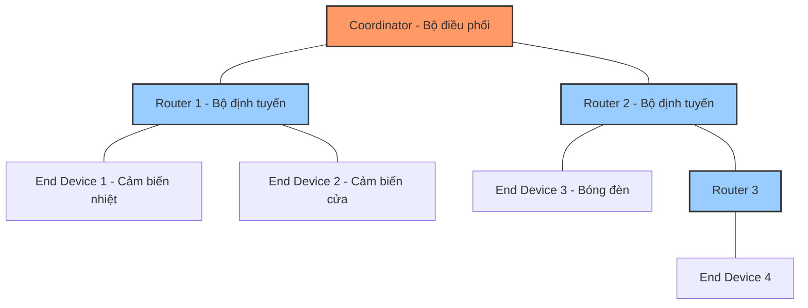
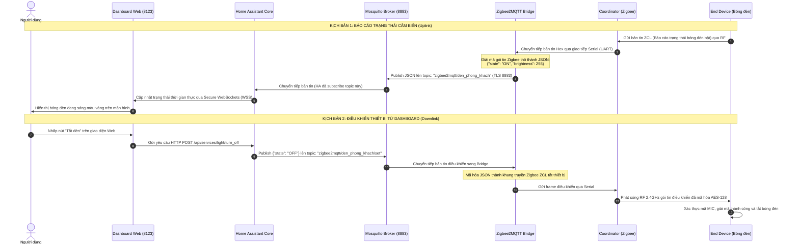
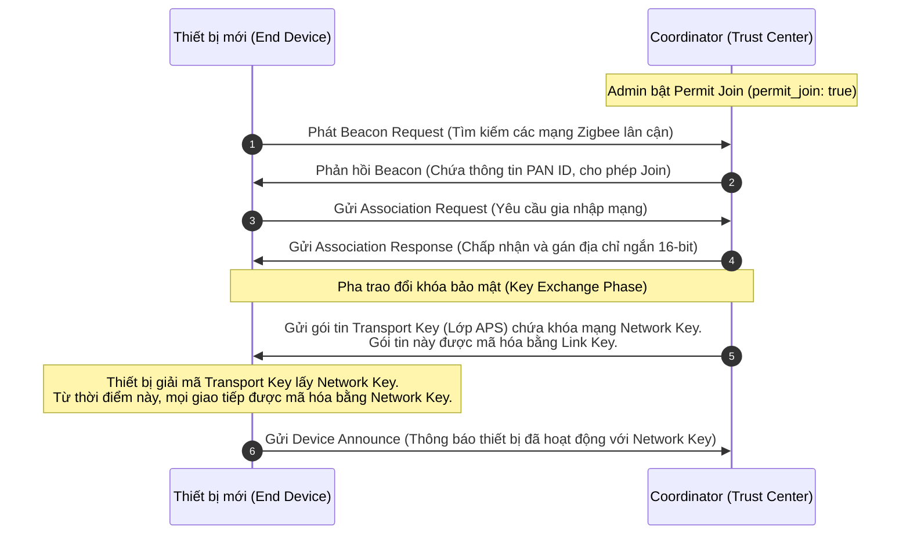

# TIỂU LUẬN: ĐÁNH GIÁ VÀ TĂNG CƯỜNG BẢO MẬT GIAO THỨC ZIGBEE TRONG HỆ THỐNG NHÀ THÔNG MINH (SMART HOME)

---

**THÔNG TIN CHUNG:**
* **Đề tài**: Đề tài 16. Bảo mật Zigbee trong nhà thông minh
* **Mã học phần**: 253INT441001
* **Lớp**: Bảo mật Zigbee trong nhà thông minh
* **Giảng viên hướng dẫn**: Th.S Hồ Nhựt Minh
* **Thành viên thực hiện**: Bùi Thị Kim Ngân

---

## MỤC LỤC
1. [MỞ ĐẦU](#1-mở-đầu)
2. [CƠ SỞ LÝ THUYẾT VỀ MẠNG ZIGBEE & BẢO MẬT](#2-cơ-sở-lý-thuyết-về-mạng-zigbee--bảo-mật)
3. [PHƯƠNG PHÁP THỰC HIỆN & MÔ HÌNH HỆ THỐNG](#3-phương-pháp-thực-hiện--mô-hình-hệ-thống)
4. [PHÂN TÍCH RỦI RO QUÁ TRÌNH GIA NHẬP MẠNG](#4-phân-tích-rủi-ro-quá-trình-gia-nhập-mạng)
5. [ĐÁNH GIÁ BẢO MẬT CHUYÊN SÂU & KỸ THUẬT TẤN CÔNG](#5-đánh-giá-bảo-mật-chuyên-sâu--kỹ-thuật-tấn-công)
6. [ĐỀ XUẤT CẤU HÌNH AN TOÀN CHO HỆ THỐNG](#6-đề-xuất-cấu-hình-an-toàn-cho-hệ-thống)
7. [CHECKLIST BẢO MẬT ZIGBEE & MQTT THEO CHUẨN OWASP ISVS](#7-checklist-bảo-mật-zigbee--mqtt-theo-chuẩn-owasp-isvs)
8. [KẾT LUẬN VÀ TÀI LIỆU THAM KHẢO](#8-kết-luận-và-tài-liệu-tham-khảo)

---

## 1. MỞ ĐẦU

### 1.1. Vấn đề bảo mật IoT cần giải quyết
Sự bùng nổ của các thiết bị Internet vạn vật (IoT) trong không gian nhà thông minh (Smart Home) mang lại sự tiện nghi vượt trội nhưng cũng mở ra nhiều thách thức bảo mật nghiêm trọng. Hầu hết các thiết bị IoT gia dụng như cảm biến, ổ cắm, bóng đèn thông minh đều bị giới hạn nghiêm ngặt về tài nguyên phần cứng (vi điều khiển công suất thấp, dung lượng bộ nhớ nhỏ, nguồn cấp từ pin). Điều này khiến việc áp dụng các cơ chế mã hóa bất đối xứng phức tạp hay xác thực đa nhân tố trực tiếp trên thiết bị đầu cuối trở nên bất khả thi.

Trong số các giao thức không dây tầm ngắn, **Zigbee** (dựa trên tiêu chuẩn IEEE 802.15.4) được ưa chuộng nhất nhờ mô hình mạng lưới (mesh network) tự tổ chức và mức tiêu thụ năng lượng cực thấp. Tuy nhiên, các nhà sản xuất thiết bị thương mại và cộng đồng tự lắp đặt (DIY) thường bỏ qua các bước cấu hình bảo mật cơ bản, dẫn đến việc sử dụng các khóa liên kết mặc định toàn cầu, mở trạng thái gia nhập mạng vô thời hạn hoặc không bảo mật đường truyền trung gian. Kẻ tấn công có thể lợi dụng sóng vô tuyến để thực hiện nghe lén khóa mạng, từ đó chèn mã độc, giả mạo trạng thái cảm biến hoặc gửi lệnh điều khiển trái phép (ví dụ: mở khóa cửa thông minh). Do đó, việc nghiên cứu các lỗ hổng bảo mật của Zigbee, phân tích các vector tấn công và đề xuất phương án cấu hình phòng thủ là vô cùng cấp bách.

### 1.2. Phạm vi đề tài
Tiểu luận tập trung nghiên cứu:
* Kiến trúc bảo mật đa tầng của giao thức Zigbee (tập trung vào lớp NWK và lớp APS).
* Quá trình ghép cặp thiết bị mới (Association) và rủi ro rò rỉ khóa mạng (Network Key).
* Mô hình cầu nối chuyển đổi giao thức giữa Zigbee và MQTT thông qua giải pháp **Zigbee2MQTT** kết hợp **MQTT Broker (Mosquitto)**.
* Đánh giá bảo mật dựa trên mô hình đe dọa STRIDE và xây dựng checklist an toàn thông tin dựa theo bộ tiêu chuẩn **OWASP ISVS (IoT Security Verification Standard)**.
* Đề tài được thực hiện bằng phương pháp **giả lập/mô phỏng phần mềm không dây** (qua Cooja Simulator) và **thiết lập cấu hình an toàn trên tài liệu/mã nguồn**, không yêu cầu trang bị phần cứng vật lý chuyên dụng.

---

## 2. CƠ SỞ LÝ THUYẾT VỀ MẠNG ZIGBEE & BẢO MẬT

### 2.1. Thành phần và vai trò trong mạng Zigbee
Mạng lưới Zigbee được xây dựng dựa trên cấu trúc hình cây (Tree), hình sao (Star) hoặc hình lưới (Mesh). Một mạng Zigbee tiêu chuẩn luôn gồm ba vai trò chính:



1. **Coordinator (Bộ điều phối trung tâm)**:
   * **Vai trò**: Là nút gốc duy nhất thiết lập mạng Zigbee, lựa chọn kênh tần số vô tuyến và gán ID mạng (PAN ID). 
   * **Tính năng bảo mật**: Coordinator đóng vai trò là **Trust Center (TC - Trung tâm Tin cậy)**. Nó quản lý, phân phối các khóa bảo mật (Network Key, Link Key) cho toàn bộ các thiết bị gia nhập mạng.
2. **Router (Bộ định tuyến)**:
   * **Vai trò**: Chuyển tiếp các gói tin giữa các nút nằm ngoài vùng phủ sóng trực tiếp của nhau, giúp mở rộng phạm vi mạng mesh.
   * **Tính năng**: Thường là các thiết bị có nguồn điện cấp trực tiếp (như công tắc âm tường, bóng đèn thông minh). Chúng có khả năng cho phép các thiết bị con khác kết nối qua chúng để đi về Coordinator.
3. **End Device (Thiết bị đầu cuối)**:
   * **Vai trò**: Chỉ giao tiếp trực tiếp với nút cha của nó (Coordinator hoặc Router gần nhất) mà không thực hiện chuyển tiếp gói tin cho thiết bị khác.
   * **Tính năng**: Thường là các thiết bị chạy bằng pin (cảm biến cửa, cảm biến chuyển động) có thể chuyển sang chế độ ngủ (Sleep mode) để tiết kiệm năng lượng tối đa.

### 2.2. Kiến trúc bảo mật đa tầng của Zigbee
Cơ chế bảo mật của Zigbee được tích hợp trong hai lớp chính của kiến trúc stack:

* **Lớp mạng (NWK - Network Layer)**: 
  * Đảm bảo tính bảo mật cho toàn bộ lưu lượng dữ liệu truyền tải nội bộ thông qua việc sử dụng chung một khóa mạng **Network Key (128-bit)**.
  * Lớp này áp dụng thuật toán mã hóa đối xứng **AES-128 CCM** (Counter with CBC-MAC) để mã hóa dữ liệu và tạo mã xác thực thông điệp **MIC (Message Integrity Code)** nhằm phát hiện hành vi can thiệp trái phép.
* **Lớp hỗ trợ ứng dụng (APS - Application Support Sublayer)**:
  * Cho phép bảo mật điểm - điểm (End-to-End) giữa hai thiết bị cụ thể trong mạng bằng cách sử dụng **Link Key (Khóa liên kết)**.
  * APS mã hóa quá trình truyền tải Network Key từ Trust Center tới một thiết bị mới gia nhập mạng. Nếu không có lớp bảo mật APS, Network Key sẽ phải truyền đi dưới dạng bản rõ (Clear text) qua sóng vô tuyến, tạo lỗ hổng chí mạng.

### 2.3. Các loại Khóa bảo mật (Cryptographic Keys)
* **Network Key**: Khóa chung cho cả mạng. Mọi thiết bị muốn truyền thông với nhau trong cùng một mạng Zigbee bắt buộc phải sở hữu chung khóa này để giải mã gói tin lớp NWK.
* **Link Key**: Khóa riêng giữa hai thiết bị (thường là giữa một thiết bị bất kỳ với Trust Center). Link Key được chia làm hai loại:
  * **Global Link Key (Khóa liên kết mặc định)**: Mặc định là chuỗi `ZigBeeAlliance09` (mã Hex: `5A:69:67:42:65:65:41:6C:6C:69:61:6E:63:65:30:39`). Được cài sẵn trên hầu hết các thiết bị thương mại để đảm bảo tính tương thích và dễ dàng ghép cặp.
  * **Unique Link Key / Install Code (Khóa liên kết duy nhất)**: Được tạo ra dựa trên một chuỗi số (Install Code) dán nhãn vật lý trên vỏ thiết bị do nhà sản xuất cung cấp. Khóa này chỉ có thiết bị đó và Coordinator biết, mang lại độ bảo mật cao nhất khi ghép cặp thiết bị mới.

### 2.4. Giới thiệu các dự án nguồn mở tham chiếu
* **Zigbee2MQTT ([Koenkk/zigbee2mqtt](https://github.com/Koenkk/zigbee2mqtt))**:
  * Là một giải pháp cầu nối (Bridge) mã nguồn mở rất phổ biến. Nó đọc dữ liệu thô từ USB Dongle Zigbee (chạy chip CC2652, CC2531...) và chuyển đổi (map) các gói tin Zigbee thành các bản tin dạng JSON truyền qua giao thức MQTT.
  * Zigbee2MQTT đóng vai trò cấu hình và vận hành Coordinator. Bảo mật của hệ thống Smart Home phụ thuộc lớn vào việc cấu hình tệp `configuration.yaml` của dịch vụ này.
* **zigpy ([zigpy/zigpy](https://github.com/zigpy/zigpy))**:
  * Thư viện Python triển khai toàn bộ stack Zigbee độc lập. Nó được sử dụng trong các hệ thống tự động hóa nhà ở như Home Assistant (phần tích hợp ZHA). Hiểu zigpy giúp phân tích cách các API nội bộ quản lý cơ sở dữ liệu khóa và xử lý khung truyền nhận vô tuyến.
* **OWASP ISVS ([OWASP/IoT-Security-Verification-Standard-ISVS](https://github.com/OWASP/IoT-Security-Verification-Standard-ISVS))**:
  * Tiêu chuẩn kiểm tra an ninh IoT toàn diện. Tài liệu này cung cấp các checklist cụ thể cho phần cứng, phần mềm, truyền thông vô tuyến và tầng cổng kết nối (Gateway). Đề tài sẽ trích lọc các tiêu chí của ISVS để xây dựng bảng checklist bảo mật cho hệ thống Zigbee-MQTT.

---

## 3. PHƯƠNG PHÁP THỰC HIỆN & MÔ HÌNH HỆ THỐNG

### 3.1. Sơ đồ kiến trúc kết nối mạng Zigbee sang MQTT
Dữ liệu từ các cảm biến vật lý hoặc giả lập chạy qua mạng mesh Zigbee, đi qua bộ chuyển đổi giao thức và được hiển thị trên giao diện người dùng. Sơ đồ kiến trúc kết nối được mô tả như sau:

```mermaid
graph LR
    subgraph Mạng Không dây Zigbee
        ED[End Device: Cảm biến] <-->|Sóng RF 2.4GHz| R[Router: Bóng đèn]
        R <-->|Sóng RF 2.4GHz| C[Coordinator: USB Dongle]
        ED <-->|Sóng RF 2.4GHz| C
    end
    
    subgraph Cầu nối & Xử lý (Gateway)
        C <-->|Giao tiếp Serial UART /dev/ttyUSB0| Z2M[Zigbee2MQTT Bridge]
    end
    
    subgraph Hạ tầng Mạng LAN & Dashboard
        Z2M <-->|MQTT over TLS Cổng 8883| Broker[Mosquitto MQTT Broker]
        Broker <-->|API / WebSockets| HA[Home Assistant Core]
        HA <-->|HTTPS Cổng 8123| Web[User Dashboard / Web UI]
    end
    
    style C fill:#f96,stroke:#333,stroke-width:2px
    style Z2M fill:#f9f,stroke:#333,stroke-width:2px
    style Broker fill:#9f9,stroke:#333,stroke-width:2px
    style HA fill:#9cf,stroke:#333,stroke-width:2px
```

### 3.2. Sơ đồ luồng dữ liệu (Data Flow Diagram - DFD) và Topic MQTT
Dưới đây là luồng gói tin thực tế khi thiết bị gửi dữ liệu lên Dashboard và khi người dùng ra lệnh điều khiển thiết bị:



### 3.3. Đặc tả Topic và Request/Response chính
1. **Topic cập nhật trạng thái (Uplink)**: 
   * **Topic**: `zigbee2mqtt/[device_friendly_name]`
   * **Payload (JSON)**:
     ```json
     {
       "state": "ON",
       "brightness": 254,
       "linkquality": 115,
       "update": {"state": "idle"},
       "battery": 98
     }
     ```
2. **Topic ra lệnh điều khiển (Downlink)**:
   * **Topic**: `zigbee2mqtt/[device_friendly_name]/set`
   * **Payload gửi đi (JSON)**:
     ```json
     {
       "state": "OFF"
     }
     ```
3. **Topic quản lý trạng thái của Bridge (Telemetry)**:
   * **Topic**: `zigbee2mqtt/bridge/state`
   * **Payload**: `online` hoặc `offline` (Dùng LWT - Last Will and Testament để phát hiện Gateway mất kết nối).

---

## 4. PHÂN TÍCH RỦI RO QUÁ TRÌNH GIA NHẬP MẠNG

### 4.1. Quá trình gia nhập mạng (Association) tiêu chuẩn
Khi một thiết bị Zigbee mới muốn tham gia vào mạng, quá trình bắt tay được thực hiện theo các bước sau:



### 4.2. Rủi ro khi thêm thiết bị mới và Quản lý khóa mạng
Lỗ hổng bảo mật cốt lõi nằm ở **Bước số 6 (Pha trao đổi khóa)**:
* **Sự cố rò rỉ khóa qua Link Key mặc định**: Để đảm bảo mọi thiết bị từ các nhà sản xuất khác nhau đều có thể kết nối ngay lập tức, đặc tả Zigbee Home Automation quy định một khóa liên kết mặc định toàn cầu (`ZigBeeAlliance09`). Nếu thiết bị mới và Coordinator sử dụng khóa này, gói tin `Transport Key` truyền qua sóng vô tuyến sẽ được mã hóa bằng khóa công khai đã biết này.
* **Nguy cơ nghe lén**: Kẻ tấn công đặt một thiết bị bắt gói tin vô tuyến ảo (Sniffer) trong khu vực, bắt lại toàn bộ quá trình ghép cặp. Do khóa `ZigBeeAlliance09` được công khai và tích hợp sẵn trong Wireshark, kẻ tấn công có thể giải mã gói tin `Transport Key` ở bước 6 để lấy ra **Network Key** dạng rõ ràng. Khi đã có Network Key, kẻ tấn công hoàn toàn giải mã và kiểm soát được toàn bộ lưu lượng dữ liệu tiếp theo của mạng lưới.
* **Nguy cơ thiết bị lạ (Rogue Node) tham gia mạng**: Nếu quản trị viên cấu hình bật tính năng cho phép thiết bị mới gia nhập mạng vô hạn (`permit_join: true` liên tục), kẻ tấn công ở gần có thể cấu hình một node giả lập gửi yêu cầu gia nhập mạng. Coordinator sẽ tự động chấp nhận, cấp Network Key cho thiết bị lạ và cho phép nó gửi các lệnh điều khiển nguy hiểm từ bên trong mạng mesh.

---

## 5. ĐÁNH GIÁ BẢO MẬT CHUYÊN SÂU & KỸ THUẬT TẤN CÔNG

Để minh chứng cho các lỗ hổng bảo mật vô tuyến trên mạng Zigbee mô phỏng, phần này phân tích 5 khía cạnh tấn công và phòng thủ chính:

### 5.1. Nghe lén (Sniffing)
* **Phương thức**: Kẻ tấn công sử dụng các công cụ như KillerBee (ví dụ: lệnh `zbsniff`) hoặc tính năng Radio Logger trong trình giả lập Cooja để bắt các khung truyền IEEE 802.15.4 ảo trên kênh tần số vô tuyến đang chạy mạng Zigbee (thường là kênh 11). Dữ liệu sau đó được ghi ra tệp `.pcap`.
* **Hậu quả**: Khi mở tệp này bằng Wireshark, nếu Trust Center sử dụng khóa liên kết mặc định, Wireshark sẽ tự động giải mã và hiển thị thông tin gói tin thô. Kẻ tấn công đọc được toàn bộ trạng thái cảm biến (ví dụ: cảm biến cửa báo trạng thái `0x00` - Đã mở), xâm phạm quyền riêng tư của người dùng.

### 5.2. Giả mạo (Spoofing)
* **Phương thức**: Khi đã trích xuất được khóa Network Key qua cuộc tấn công Sniffing ở pha ghép cặp, kẻ tấn công có thể tạo ra các khung truyền mạng Zigbee ảo có địa chỉ nguồn (MAC Address) giả mạo một cảm biến nhiệt độ hoặc cảm biến báo cháy trong nhà thông minh.
* **Hậu quả**: Thiết bị Coordinator nhận gói tin, xác thực mã MIC hợp lệ (vì kẻ tấn công dùng đúng Network Key để tính toán MIC), và cập nhật thông tin giả mạo lên Dashboard. Điều này có thể kích hoạt các kịch bản báo động giả liên tục hoặc vô hiệu hóa các kịch bản tự động hóa an toàn.

### 5.3. Phát lại (Replay Attack)
* **Phương thức**: Kẻ tấn công ghi lại một gói tin điều khiển hợp lệ được truyền từ Coordinator đến một bóng đèn hoặc ổ cắm (ví dụ: gói tin ra lệnh bật nguồn điện). Sau đó, không cần phải giải mã hay biết khóa bảo mật, kẻ tấn công phát lại (Replay/Inject) nguyên vẹn gói tin này vào kênh truyền sóng.
* **Hậu quả**: Trong các phiên bản Zigbee cũ hoặc các thiết bị giá rẻ không thực hiện kiểm tra chặt chẽ số thứ tự khung truyền (**Sequence Number**) hoặc bộ đếm khung truyền lớp mạng (**NWK Frame Counter**), thiết bị nhận sẽ chấp nhận gói tin phát lại như một lệnh mới và đổi trạng thái thiết bị. Điều này đặc biệt nguy hiểm với các thiết bị như khóa cửa thông minh. Ở các hệ thống mới, việc sử dụng mã bảo mật AES-128 CCM tích hợp bộ đếm Frame Counter tăng dần giúp loại bỏ nguy cơ này, nhưng nếu thiết bị không lưu trữ tốt Frame Counter sau khi bị mất nguồn điện đột ngột (Power Cycle), rủi ro phát lại vẫn hiện hữu.

### 5.4. Phân quyền (Authorization)
* **Phương thức**: Đánh giá tính phân quyền tại hai giao diện trung gian: Giao diện Web Admin của Zigbee2MQTT và MQTT Broker. Nếu cấu hình mặc định không yêu cầu mật khẩu, bất kỳ thiết bị nào trong mạng nội bộ (LAN) đều có thể kết nối.
* **Hậu quả**: Kẻ tấn công chiếm quyền điều khiển bằng cách kết nối trực tiếp vào MQTT Broker, tự gửi bản tin điều khiển đến topic `zigbee2mqtt/thiet_bi/set` hoặc gửi lệnh xóa thiết bị (`factory reset`) qua API của Zigbee2MQTT.

### 5.5. Mã hóa (Encryption)
* **Phương thức**: Đánh giá thuật toán mã hóa AES-128 CCM được sử dụng trong Zigbee. Thuật toán này về mặt lý thuyết là rất an toàn và chưa thể bị bẻ khóa bằng các phương pháp toán học thông thường trong thời gian ngắn. Tuy nhiên, điểm yếu nằm ở việc phân phối khóa mật mã. Nếu khóa mật mã không được sinh ngẫu nhiên mà sử dụng chuỗi mặc định dễ đoán, tính năng mã hóa coi như vô hiệu.

---

## 6. ĐỀ XUẤT CẤU HÌNH AN TOÀN CHO HỆ THỐNG

Để bảo vệ toàn diện hệ thống Zigbee trong nhà thông minh, cần áp dụng các biện pháp củng cố cấu hình (Hardening) đồng thời ở cả hai tầng: Mạng vô tuyến Zigbee và Cầu nối truyền tải dữ liệu MQTT.

### 6.1. Bảng đối chiếu cấu hình Mặc định và Cấu hình An toàn
Dưới đây là bảng so sánh chi tiết các thiết lập trên bộ Gateway trung tâm chạy **Zigbee2MQTT**:

| Tham số cấu hình | Cấu hình mặc định (Nguy hiểm) | Cấu hình an toàn đề xuất (Hardened) | Giải thích kỹ thuật & Tác động bảo mật |
| :--- | :--- | :--- | :--- |
| `permit_join` | `true` (Mở liên tục) | `false` (Luôn tắt) | Chỉ mở khi cần thêm thiết bị mới và tự động tắt sau 60-120 giây. Ngăn chặn thiết bị lạ tự động gia nhập mạng. |
| `network_key` | Sử dụng chuỗi số mặc định hoặc dễ đoán. | `generate` (Tự động sinh ngẫu nhiên) | Zigbee2MQTT tự tạo khóa mạng 128-bit ngẫu nhiên và duy nhất khi khởi động lần đầu, triệt tiêu nguy cơ đoán khóa. |
| `pan_id` | `0x1a2b` | Ngẫu nhiên (Ví dụ: `0x4f8d`) | Hạn chế việc quét mạng dò tìm loại thiết bị dựa trên PAN ID mặc định của nhà sản xuất. |
| `ext_pan_id` | `[0xdd, 0xdd, 0xdd, 0xdd, ...]` | Ngẫu nhiên (Ví dụ: `[0x2e, 0xa5, 0x9c, ...]`) | Tương tự PAN ID, đổi Extended PAN ID giúp mạng tránh bị nhận diện thụ động bởi các thiết bị quét sóng. |
| `channel` | Kênh `11` | Kênh `15`, `20`, `25` hoặc `26` | Tránh chồng chéo tần số với các kênh Wi-Fi 2.4GHz phổ biến (kênh 1, 6, 11), giảm thiểu nhiễu và nguy cơ bị tấn công từ chối dịch vụ (Jamming). |
| `mqtt.server` | `mqtt://localhost:1883` | `mqtts://localhost:8883` | Mã hóa toàn bộ dữ liệu truyền giữa Gateway và MQTT Broker bằng giao thức TLS/SSL, chống nghe lén trong mạng LAN. |
| `mqtt.user` & `password` | Không thiết lập (Anonymous) | Đặt Username và Mật khẩu độ phức tạp cao. | Ngăn chặn truy cập trái phép và chèn lệnh điều khiển từ các thiết bị khác trong cùng mạng nội bộ. |
| `frontend` | Bật HTTP không mật khẩu lắng nghe trên `0.0.0.0:8080`. | Lắng nghe trên `127.0.0.1:8443`, kích hoạt HTTPS và đặt `auth_token` bảo mật. | Bảo vệ trang quản trị web của Bridge, chỉ cho phép truy cập cục bộ hoặc thông qua Reverse Proxy (Nginx) có xác thực. |

### 6.2. File cấu hình an toàn thực tế (`configuration.yaml` của Zigbee2MQTT)
Đoạn mã cấu hình mẫu tối ưu hóa an ninh cho hệ thống:

```yaml
# ==============================================================================
# FILE CẤU HÌNH AN TOÀN CHO ZIGBEE2MQTT (HARDENED CONFIGURATION)
# ==============================================================================

# Tích hợp với Home Assistant
homeassistant: true

# 1. Cấu hình bảo mật tầng truyền tải MQTT
mqtt:
  server: 'mqtts://127.0.0.1:8883' # Sử dụng giao thức mã hóa TLS
  user: 'gateway_coordinator_node'  # Tài khoản truy cập broker riêng biệt
  password: 'Zg2Mqtt_SecurePassword_!2026_#' # Mật khẩu mạnh tự sinh
  # Cấu hình chứng chỉ bảo mật TLS mã hóa đường truyền
  ca: /app/data/certs/ca.crt
  cert: /app/data/certs/client.crt
  key: /app/data/certs/client.key

# 2. Cấu hình kết nối phần cứng USB Dongle
serial:
  port: /dev/ttyUSB0
  adapter: zstack # Dành cho chip TI CC2652/CC1352

# 3. Củng cố an ninh mạng vô tuyến Zigbee (Hardening Advanced)
advanced:
  pan_id: 0x5d9b # PAN ID ngẫu nhiên (tránh 0x1a2b mặc định)
  ext_pan_id: [0x3c, 0xf1, 0xa9, 0x22, 0x8b, 0xce, 0x4d, 0x7e] # Ext PAN ID ngẫu nhiên
  channel: 25 # Kênh 25 ít bị chồng lấn bởi sóng Wi-Fi 2.4GHz
  
  # Yêu cầu sinh khóa mạng ngẫu nhiên khi tạo mạng lần đầu tiên
  network_key: generate
  
  # Cài đặt công suất phát sóng (dBm) - Điều chỉnh vừa đủ trong nhà để tránh rò rỉ sóng ra quá xa ngoài đường
  transmit_power: 10

# 4. Kiểm soát thiết bị gia nhập mạng
permit_join: false # Mặc định LUÔN đóng. Chỉ mở thủ công qua API trong thời gian giới hạn.

# 5. Bảo mật giao diện Web quản trị (Frontend)
frontend:
  port: 8443
  host: 127.0.0.1 # Chỉ lắng nghe trên localhost (yêu cầu cấu hình Reverse Proxy HTTPS để truy cập từ ngoài)
  auth_token: 'Token_Secure_WebUI_Access_9988_!#' # Token xác thực bắt buộc
```

### 6.3. Giải pháp củng cố bảo mật bổ sung
1. **Sử dụng Install Codes (Mã cài đặt thiết bị)**:
   * Đối với các thiết bị Zigbee 3.0, tuyệt đối không dùng phương pháp ghép cặp bằng khóa liên kết mặc định `ZigBeeAlliance09`. 
   * Thay vào đó, nhập trực tiếp mã Install Code (in trên nhãn thiết bị) vào giao diện Zigbee2MQTT trước khi cho phép thiết bị join. Coordinator sẽ sử dụng Install Code này để sinh ra một khóa liên kết duy nhất (Unique Link Key), dùng riêng để mã hóa gói tin truyền Network Key cho thiết bị đó.
2. **Sao lưu khóa mạng an toàn (Key Backup)**:
   * Lưu trữ các tệp tin cấu hình (`configuration.yaml`, `database.db`) tại các thư mục có quyền truy cập hạn chế (chỉ quyền `root` hoặc user `zigbee2mqtt` được phép đọc/ghi).
   * Định kỳ sao lưu mã hóa các tệp cấu hình này sang máy chủ sao lưu độc lập.
3. **Bảo mật MQTT Broker (Mosquitto Broker Hardening)**:
   * Tắt hoàn toàn chế độ kết nối ẩn danh (`allow_anonymous false` trong file `mosquitto.conf`).
   * Sử dụng cơ chế phân quyền kiểm soát truy cập **ACL (Access Control List)** để quy định rõ: Client `zigbee2mqtt` chỉ được phép publish/subscribe các topic `zigbee2mqtt/#`, còn Client `homeassistant` chỉ được đọc trạng thái và ghi lên topic `/set`. Ngăn chặn việc một thiết bị IoT bị hack ở tầng LAN có thể subscribe và đọc trộm toàn bộ luồng thông tin của các thiết bị khác.

---

## 7. CHECKLIST BẢO MẬT ZIGBEE & MQTT THEO CHUẨN OWASP ISVS

Bảng kiểm dưới đây được thiết kế dựa trên các tiêu chí tương ứng trong tiêu chuẩn **OWASP IoT Security Verification Standard (ISVS)** phiên bản mới nhất, áp dụng cụ thể cho giải pháp Zigbee2MQTT và hệ thống Smart Home.

| Mã số ISVS | Hạng mục kiểm tra bảo mật (Verification Requirement) | Trạng thái (Đạt/Không) | Biện pháp kỹ thuật áp dụng |
| :--- | :--- | :--- | :--- |
| **V1.1** | **Xác thực và phân quyền truy cập cổng Gateway**: Đảm bảo tất cả các giao diện quản trị (Web UI, API) yêu cầu xác thực mạnh trước khi sử dụng. | [ ] Đạt | Đã kích hoạt mật khẩu và `auth_token` trên giao diện Web Frontend của Zigbee2MQTT, đổi cổng mặc định. |
| **V2.1** | **Bảo mật truyền thông mạng LAN**: Mọi luồng truyền tải dữ liệu giữa Gateway và các dịch vụ khác (MQTT Broker) phải được mã hóa. | [ ] Đạt | Chuyển đổi toàn bộ kết nối sang giao thức `mqtts://` chạy trên cổng 8883 có mã hóa TLS 1.3. |
| **V2.3** | **Tắt các cổng dịch vụ không mã hóa**: Đảm bảo các cổng giao tiếp không mã hóa (như MQTT Port 1883) được đóng hoàn toàn. | [ ] Đạt | Cấu hình Mosquitto Broker đóng cổng 1883, chỉ mở cổng xác thực TLS 8883. |
| **V3.2** | **Sinh khóa mật mã ngẫu nhiên**: Các khóa bảo mật mạng không được sử dụng các giá trị mặc định của nhà sản xuất hoặc giá trị dễ đoán. | [ ] Đạt | Sử dụng cấu hình `network_key: generate` để tự động tạo khóa mạng Zigbee ngẫu nhiên 128-bit. |
| **V3.5** | **Bảo mật pha ghép đôi (Pairing Phase)**: Quá trình phân phối khóa mạng cho thiết bị mới phải sử dụng cơ chế mã hóa riêng biệt. | [ ] Đạt | Áp dụng cơ chế **Install Code (Zigbee 3.0)** để tạo Unique Link Key thay vì dùng khóa mặc định toàn cầu. |
| **V4.1** | **Giới hạn thời gian gia nhập mạng**: Trạng thái cho phép ghép cặp thiết bị mới chỉ được mở khi cần thiết và có giới hạn thời gian tự động đóng. | [ ] Đạt | Đặt `permit_join: false` mặc định trong cấu hình; thiết lập kịch bản tự động tắt sau 60 giây khi kích hoạt bằng nút bấm vật lý. |
| **V5.1** | **Phân quyền truy cập tài nguyên MQTT (ACLs)**: Thực hiện nguyên tắc đặc quyền tối thiểu đối với các client kết nối vào MQTT Broker. | [ ] Đạt | Cấu hình tệp tin ACL trên Mosquitto chỉ cho phép các Client đọc/ghi đúng các topic chức năng được chỉ định. |
| **V6.2** | **Quản lý và cập nhật Firmware an toàn**: Đảm bảo firmware của Coordinator và thiết bị đầu cuối được cập nhật định kỳ và kiểm tra chữ ký số hợp lệ. | [ ] Đạt | Kích hoạt tính năng kiểm tra OTA Updates từ nguồn chính thức của Zigbee2MQTT; chỉ nạp firmware có chữ ký số của nhà sản xuất. |

---

## 8. KẾ LUẬN VÀ TÀI LIỆU THAM KHẢO

### 8.1. Kết luận và Bài học kinh nghiệm
Thông qua quá trình nghiên cứu và thực nghiệm mô phỏng hệ thống bảo mật Zigbee, nhóm thực hiện đã rút ra các kết luận quan trọng sau:

* **3 bài học học được**:
  1. *Bảo mật hệ thống là một chuỗi liên kết*: Một hệ thống Smart Home chỉ an toàn khi tất cả các mắt xích đều được bảo vệ. Việc mã hóa rất tốt ở sóng Zigbee sẽ vô tác dụng nếu cổng kết nối MQTT Broker bên trong mạng LAN bị bỏ ngỏ cho phép kết nối không mật khẩu (port 1883).
  2. *Vai trò quyết định của Quản lý khóa*: Lỗ hổng bảo mật lớn nhất của Zigbee không nằm ở thuật toán AES-128, mà nằm ở phương thức trao đổi khóa mạng. Việc chuyển đổi từ khóa liên kết mặc định (`ZigBeeAlliance09`) sang mã Install Code là yếu tố cốt lõi để chống lại cuộc tấn công nghe lén vô tuyến.
  3. *Tầm quan trọng của Cấu hình mặc định an toàn (Secure by Default)*: Người dùng và kỹ sư triển khai cần có thói quen thay đổi toàn bộ thông số mặc định (PAN ID, Channel, Network Key, Port) ngay khi thiết lập hệ thống để giảm thiểu tối đa các dấu hiệu nhận biết mạng đối với kẻ tấn công.
* **2 hạn chế của đề tài**:
  1. *Chưa triển khai trên thiết bị phần cứng thực tế*: Do giới hạn thiết bị phòng Lab, các kịch bản tấn công nghe lén giải mã và phát lại mới chỉ dừng lại ở mức mô phỏng trên phần mềm Cooja (Contiki-NG) và phân tích các tệp lưu vết pcap ảo, chưa đánh giá được ảnh hưởng của môi trường vật lý thực tế (nhiễu sóng, vật cản).
  2. *Chưa đánh giá hết các lỗ hổng khai thác firmware (Exploits)*: Đề tài tập trung vào lỗ hổng kiến trúc giao thức và cấu hình hệ thống, chưa đi sâu phân tích các lỗ hổng bảo mật cụ thể trong mã nguồn firmware của các nhà sản xuất phần cứng cụ thể (lỗi tràn bộ đệm, bypass xác thực phần cứng).

### 8.2. Hướng phát triển tiếp theo
* Dựng mô hình Lab thực tế sử dụng mạch nạp USB Dongle CC2652P kết hợp mạch bắt sóng chuyên dụng (SDR - Software Defined Radio hoặc USB Sniffer CC2531 chạy firmware sniffer) để kiểm chứng khả năng bắt gói tin và giải mã sóng thực tế trong nhà ở gia đình.
* Nghiên cứu sâu hơn cơ chế cập nhật firmware bảo mật qua sóng (OTA) và cách thức ký số để chống lại mã độc chèn vào thiết bị.

### 8.3. Tài liệu tham khảo
1. **Koenkk**. *Zigbee2MQTT Documentation: Bridge Zigbee devices to MQTT*. [https://github.com/Koenkk/zigbee2mqtt](https://github.com/Koenkk/zigbee2mqtt).
2. **zigpy Contributors**. *zigpy: Python implementation of the Zigbee stack*. [https://github.com/zigpy/zigpy](https://github.com/zigpy/zigpy).
3. **OWASP Foundation**. *IoT Security Verification Standard (ISVS) v1.0*. [https://github.com/OWASP/IoT-Security-Verification-Standard-ISVS](https://github.com/OWASP/IoT-Security-Verification-Standard-ISVS).
4. **Contiki-NG & Cooja Contributors**. *Cooja Simulator for Wireless Sensor Networks*. [https://github.com/contiki-ng/contiki-ng](https://github.com/contiki-ng/contiki-ng).
5. **Zigbee Alliance**. *Zigbee Specification Revision 21 (R21) - Security Architecture*. Zigbee Document 05-3474-21.
6. **Wright, J.** *KillerBee: Practical Zigbee Exploitation Framework*. River Loop Security. [https://github.com/riverloopsec/killerbee](https://github.com/riverloopsec/killerbee).
