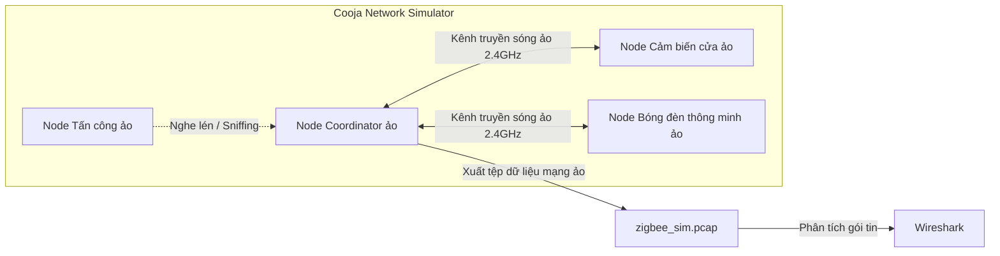

# BÁO CÁO PHÂN TÍCH VÀ MÔ PHỎNG BẢO MẬT GIAO THỨC ZIGBEE TRONG HỆ THỐNG NHÀ THÔNG MINH (SMART HOME)

---

## MỤC LỤC
1. [GIỚI THIỆU & TÍNH CẤP THIẾT CỦA ĐỀ TÀI](#1-giới-thiệu--tính-cấp-thiết-của-đề-tài)
2. [MỤC TIÊU VÀ PHẠM VI NGHIÊN CỨU](#2-mục-tiêu-và-phạm-vi-nghiên-cứu)
3. [BẢNG ÁNH XẠ GIAO THỨC - CỔNG - CƠ CHẾ BẢO MẬT](#3-bảng-ánh-xạ-giao-thức---cổng---cơ-chế-bảo-mật)
4. [ĐỐI CHIẾU CẤU HÌNH MẶC ĐỊNH VÀ CẤU HÌNH AN TOÀN](#4-đối-chiếu-cấu-hình-mặc-định-và-cấu-hình-an-toàn)
5. [MÔ HÌNH MÔ PHỎNG LAB & KỊCH BẢN KIỂM CHỨNG BẢO MẬT](#5-mô-hình-mô-phỏng-lab--kịch-bản-kiểm-chứng-bảo-mật)
6. [KẾ HOẠCH TUẦN 03 & CHECKLIST ĐÁNH GIÁ AN TOÀN THÔNG TIN](#6-kế-hoạch-tuần-03--checklist-đánh-giá-an-toàn-thông-tin)
7. [MÔ HÌNH PHÂN TÍCH MỐI ĐE DỌA STRIDE](#7-mô-hình-phân-tích-mối-đe-dọa-stride)
8. [TÀI LIỆU THAM KHẢO](#8-tài-liệu-tham-khảo)

---

## 1. GIỚI THIỆU & TÍNH CẤP THIẾT CỦA ĐỀ TÀI

Trong kỷ nguyên Internet vạn vật (IoT), hệ thống nhà thông minh (Smart Home) đang chứng kiến sự bùng nổ mạnh mẽ. Trong số các tiêu chuẩn kết nối không dây, **Zigbee** (dựa trên tiêu chuẩn IEEE 802.15.4) đã trở thành một trong những giao thức truyền thông phổ biến nhất nhờ vào các ưu điểm vượt trội: tiêu thụ năng lượng cực thấp, khả năng tự tổ chức mạng lưới (mesh network) linh hoạt và chi phí triển khai rẻ.

Tuy nhiên, do các thiết bị Zigbee đầu cuối thường bị giới hạn về năng lượng pin và năng lực xử lý của vi điều khiển, việc áp dụng các thuật toán mã hóa và xác thực phức tạp gặp nhiều rào cản. Thực tiễn triển khai cho thấy, phần lớn các lỗ hổng bảo mật không đến từ bản thân thuật toán mã hóa AES-128 được Zigbee sử dụng, mà đến từ **cách thức quản lý khóa (Key Management)** và **các cấu hình mặc định (Default Configurations)** của nhà sản xuất hoặc người dùng tự lắp đặt (DIY). Việc sử dụng khóa liên kết mặc định toàn cầu (`ZigBeeAlliance09`), để trạng thái cho phép gia nhập mạng luôn mở (`Permit Join: true`), hay không sử dụng HTTPS/TLS ở các tầng ứng dụng trung gian tạo ra những véc-tơ tấn công nguy hiểm.

Để phân tích và đánh giá các nguy cơ này mà không yêu cầu chi phí phần cứng cao, phương pháp **mô phỏng phần mềm (Software-based Simulation)** đóng vai trò quan trọng. Báo cáo này tập trung vào việc nghiên cứu kiến trúc bảo mật của Zigbee, thiết lập môi trường mô phỏng không dây bằng **Cooja Simulator (Contiki-NG)** kết hợp với phân tích lưu lượng gói tin ảo trên **Wireshark**, thực hiện các kịch bản tấn công giả lập (Sniffing, Replay) và đề xuất các giải pháp tăng cường bảo mật (Hardening) thực tế.

---

## 2. MỤC TIÊU VÀ PHẠM VI NGHIÊN CỨU

### 2.1. Mục tiêu đề tài
* **Nghiên cứu lý thuyết**: Làm rõ kiến trúc bảo mật đa tầng của Zigbee (Physical, MAC, Network, Application Support Sublayer).
* **Mô phỏng thực nghiệm**: Thiết lập một mô hình mạng Zigbee ảo để tái dựng các kịch bản tấn công nghe lén thu giữ khóa mạng và tấn công phát lại (Replay Attack) điều khiển thiết bị ảo.
* **Đề xuất giải pháp**: Xây dựng cấu hình an toàn cho bộ điều phối trung tâm Zigbee2MQTT ảo và thiết lập checklist kiểm toán an ninh mạng.

### 2.2. Phạm vi nghiên cứu
* **Giao thức**: Zigbee 3.0 và Zigbee Home Automation (HA 1.2).
* **Môi trường mô phỏng**: Trình mô phỏng mạng không dây Cooja (Contiki-NG), kết hợp phần mềm bắt gói tin Wireshark và công cụ kiểm thử bảo mật không dây ảo (KillerBee / Scapy).
* **Giới hạn tấn công**: Tập trung vào lớp mạng (NWK) và lớp hỗ trợ ứng dụng (APS) trong pha ghép cặp (Pairing Phase) và pha truyền lệnh điều khiển.

---

## 3. BẢNG ÁNH XẠ GIAO THỨC - CỔNG - CƠ CHẾ BẢO MẬT

Dưới đây là sơ đồ phân tích các tầng giao tiếp trong một hệ thống Smart Home tích hợp điều phối Zigbee ảo hóa, chỉ ra các cổng dịch vụ và cơ chế bảo vệ tương ứng.

| Lớp (Layer) | Giao thức (Protocol) | Cổng mặc định (Port) | Cơ chế bảo mật chính | Mô tả và Nguy cơ trong môi trường Mô phỏng |
| :--- | :--- | :--- | :--- | :--- |
| **Physical / MAC** | IEEE 802.15.4 / Zigbee (Mô phỏng) | Không có (Sóng RF 2.4 GHz ảo - Kênh 11-26) | - Mã hóa AES-128 CCM.<br>- Khóa mạng (Network Key) chung để mã hóa lưu lượng lớp mạng.<br>- Khóa liên kết (Link Key) bảo vệ khóa mạng khi ghép đôi. | **Mô phỏng nguy cơ**: Trong phần mềm mô phỏng (như Cooja), nếu sử dụng khóa liên kết mặc định (`ZigBeeAlliance09`), node tấn công dễ dàng nghe lén (sniff) và trích xuất Network Key khi thiết bị mới gia nhập mạng. |
| **Transport / Session** | MQTT (Message Queuing Telemetry Transport) | **1883** (Không mã hóa)<br>**8883** (Mật mã TLS) | - Xác thực bằng Username/Password.<br>- Mã hóa TLS/SSL toàn bộ lưu lượng giữa Gateway ảo (Zigbee2MQTT) và MQTT Broker (Mosquitto). | **Mô phỏng nguy cơ**: Cấu hình mặc định cho phép kết nối ẩn danh (Anonymous) hoặc không mã hóa (Port 1883), dẫn đến nguy cơ dữ liệu ảo bị nghe lén và chèn lệnh điều khiển giả mạo. |
| **Application** | HTTP / HTTPS (Web Frontend - Zigbee2MQTT) | **8080** (TCP) | - HTTPS (TLS 1.2/1.3) bằng chứng chỉ SSL.<br>- Xác thực người dùng thông qua mật khẩu đăng nhập frontend.<br>- Hạn chế truy cập theo IP nguồn (IP Whitelisting). | **Mô phỏng nguy cơ**: Giao diện điều khiển Zigbee2MQTT ảo mặc định không yêu cầu mật khẩu. Bất kỳ ai trong cùng mạng LAN ảo đều có thể truy cập để sửa đổi cấu hình hoặc xóa thiết bị mô phỏng. |
| **Application** | HTTP / HTTPS (Home Assistant Core Web UI) | **8123** (TCP) | - HTTPS (SSL/TLS).<br>- Xác thực đa yếu tố (MFA).<br>- Access Token (Long-Lived Access Tokens) cho API.<br>- Tự động chặn các IP thử đăng nhập sai nhiều lần (IP Ban). | **Mô phỏng nguy cơ**: Tấn công Brute Force tài khoản quản trị giao diện điều khiển nếu không kích hoạt MFA và IP Ban; lộ dữ liệu điều khiển nhà thông minh mô phỏng nếu chạy HTTP. |
| **Session** | WebSockets / WSS (Realtime data stream) | Tích hợp trong cổng HTTP/HTTPS | - Chuyển nâng cấp giao thức từ HTTPS sang Secure WebSockets (WSS).<br>- Xác thực token tại pha kết nối đầu tiên. | **Mô phỏng nguy cơ**: Kẻ tấn công trung gian (MITM) trong mạng LAN ảo nghe lén trạng thái thiết bị mô phỏng trong thời gian thực nếu không sử dụng TLS (WSS). |
| **Network Service** | mDNS (Multicast DNS) | **5353** (UDP) | - Chỉ mở trên giao diện mạng nội bộ ảo.<br>- Cấu hình lọc gói mDNS qua Firewall nếu có nhiều phân đoạn mạng (VLAN). | **Mô phỏng nguy cơ**: Rò rỉ thông tin về sự tồn tại của Home Assistant / Gateway IoT ảo cho các thiết bị khác trong cùng mạng WiFi ảo. |
| **Management** | SSH (Secure Shell - Quản trị Hub ảo) | **22** (TCP) | - Xác thực bằng cặp khóa công khai/tư nhân (SSH Key Pair).<br>- Đổi cổng mặc định (ví dụ sang 2222).<br>- Cấu hình Fail2ban để ngăn chặn Brute force.<br>- Cấm đăng nhập bằng tài khoản `root`. | **Mô phỏng nguy cơ**: Tấn công dò mật khẩu nếu chỉ sử dụng mật khẩu yếu cho tài khoản pi/root trên hệ điều hành máy chủ ảo làm Hub. |

---

## 4. ĐỐI CHIẾU CẤU HÌNH MẶC ĐỊNH VÀ CẤU HÌNH AN TOÀN

Bảng đối chiếu dưới đây làm rõ sự khác biệt giữa cấu hình mặc định (mức độ an toàn thấp) và cấu hình khuyến nghị (mức độ an toàn cao) đối với bộ Coordinator mô phỏng (ví dụ qua cấu hình Zigbee2MQTT).

| Khía cạnh cấu hình | Cấu hình Mặc định (Kém an toàn) | Cấu hình Khuyến nghị (An toàn / Hardened) | Cơ chế & Tác động bảo mật trong mô phỏng |
| :--- | :--- | :--- | :--- |
| **Khóa mạng (Network Key)** | - Sử dụng một khóa cố định mặc định (Ví dụ: `[1, 3, 5, 7, ...]` hoặc khóa tĩnh). | - Cấu hình khóa mạng được sinh ngẫu nhiên hoàn toàn (Ví dụ: `network_key: generate`). | **Tác động**: Ngăn chặn node tấn công giải mã toàn bộ dữ liệu lưu thông trong mạng ảo. Khóa mạng ngẫu nhiên buộc kẻ tấn công phải sniffing trực tiếp thời điểm pairing để dò khóa. |
| **Gia nhập mạng (Permit Join)** | - Trạng thái cho phép thiết bị mới kết nối luôn ở trạng thái Bật (`permit_join: true`). | - Mặc định tắt trạng thái gia nhập mạng (`permit_join: false`), chỉ mở thủ công khi cần ghép đôi và tự động tắt sau 60-120 giây. | **Tác động**: Ngăn chặn node tấn công giả mạo (Rogue Node) tự động đăng ký vào mạng Zigbee mô phỏng để thu thập dữ liệu hoặc thực hiện lệnh tấn công từ bên trong. |
| **Khóa liên kết (Link Key)** | - Sử dụng khóa liên kết mặc định toàn cầu (`ZigBeeAlliance09`). | - Sử dụng **Mã cài đặt (Install Code)** riêng biệt cho từng thiết bị ảo (chỉ có trên Zigbee 3.0). | **Tác động**: Khi thiết bị mới gia nhập mạng, khóa mạng (Network Key) truyền đi qua sóng ảo được mã hóa bằng Link Key duy nhất sinh từ Install Code thay vì khóa mặc định dễ bị Wireshark giải mã. |
| **Mã định danh mạng (PAN ID / ExtPAN ID)** | - Sử dụng các giá trị mặc định của bộ điều phối ảo (Ví dụ: PAN ID: `0x1a2b`, Extended PAN ID: `0xdddddddddddddddd`). | - Cấu hình thay đổi sang các giá trị ngẫu nhiên và duy nhất trong khu vực mô phỏng. | **Tác động**: Hạn chế việc quét mạng không dây ảo xác định được hệ thống điều phối thông qua các giá trị mặc định. |
| **Cập nhật Firmware qua sóng (OTA Updates)** | - Cho phép cập nhật tự động từ bất kỳ nguồn ảo nào mà không kiểm tra chữ ký. | - Chỉ cho phép cập nhật từ nguồn đáng tin cậy đã được xác thực và có chữ ký số. | **Tác động**: Ngăn chặn node tấn công phát sóng firmware mô phỏng giả mạo chứa mã độc để chiếm quyền điều khiển phần cứng ảo. |
| **Giao diện cấu hình Web (Frontend UI)** | - Chạy HTTP không mật khẩu, lắng nghe trên mọi giao diện mạng ảo (`0.0.0.0:8080`). | - Kích hoạt xác thực (mật khẩu mạnh), chỉ lắng nghe trên giao diện cục bộ (`127.0.0.1`) và proxy qua HTTPS. | **Tác động**: Ngăn chặn người dùng lạ trong mạng LAN ảo truy cập trái phép trang quản trị. |
| **Kênh tần số (Channel)** | - Sử dụng kênh mặc định (thường là kênh 11). | - Quét và chọn kênh Zigbee ảo ít bị nhiễu và ít chồng lấn nhất với các mạng Wi-Fi ảo lân cận (Ví dụ: Kênh 15, 20, 25). | **Tác động**: Giảm thiểu nguy cơ bị tấn công từ chối dịch vụ vật lý ảo (Jamming) vô tình hoặc cố ý từ sóng Wi-Fi ảo cường độ cao lân cận. |

---

## 5. MÔ HÌNH MÔ PHỎNG LAB & KỊCH BẢN KIỂM CHỨNG BẢO MẬT

### 5.1. Sơ đồ Kiến trúc Lab Mô phỏng
Mạng lưới thiết bị Zigbee ảo được dựng trên trình mô phỏng **Cooja** (chạy trên hệ điều hành Ubuntu/Kali Linux ảo). Lưu lượng RF ảo được thu thập trực tiếp từ Radio Logger và chuyển tiếp đến Wireshark để phân tích.



### 5.2. Kịch bản Mô phỏng 1: Sniffing & Trích xuất khóa mạng (Network Key)
1. **Dò kênh và lưu gói tin**: Kích hoạt **Radio Logger** trong Cooja, cấu hình lưu dữ liệu dưới dạng tệp tin pcap (`zigbee_sim.pcap`).
2. **Bắt pha ghép đôi (Pairing)**: Reset node cảm biến cửa ảo để gửi yêu cầu gia nhập mạng. Coordinator gửi gói tin chứa Network Key đến cảm biến.
3. **Giải mã trên Wireshark**:
   * Mở tệp `zigbee_sim.pcap` bằng Wireshark.
   * Cấu hình khóa liên kết mặc định `5A:69:67:42:65:65:41:6C:6C:69:61:6E:63:65:30:39` (ASCII: `ZigBeeAlliance09`) trong phần cấu hình của giao thức ZigBee.
   * Kết quả: Wireshark giải mã thành công gói tin **"Transport Key"** ở tầng APS và hiển thị khóa mạng **Network Key** dưới dạng rõ ràng (Clear text).

### 5.3. Kịch bản Mô phỏng 2: Tấn công phát lại (Replay Attack)
1. **Bắt gói tin điều khiển**: Tìm kiếm và trích xuất gói tin điều khiển (ZCL Command: On/Off) được gửi từ Coordinator ảo đến bóng đèn ảo. Lưu gói tin này vào tệp `control_cmd.pcap`.
2. **Thực thi tấn công phát lại**: Sử dụng script Python (Scapy) hoặc tính năng Packet Sender của node tấn công ảo trong Cooja để gửi lại chính xác gói tin điều khiển đó vào kênh không dây ảo.
3. **Kết quả**: Node bóng đèn ảo chấp nhận gói tin và đổi trạng thái (bật sang tắt hoặc ngược lại) mà không phát hiện ra gói tin do node tấn công phát lại.

### 5.4. File cấu hình mẫu an toàn của Zigbee2MQTT ảo (`configuration.yaml`)
```yaml
homeassistant: true
mqtt:
  server: 'mqtts://localhost:8883' # Sử dụng giao thức mã hóa TLS
  user: 'secure_gateway'
  password: 'StrongPassword9876!'
  ca: /app/data/certs/ca.crt
  cert: /app/data/certs/client.crt
  key: /app/data/certs/client.key
serial:
  port: /dev/ttyUSB0
  adapter: zstack
advanced:
  pan_id: 0x4f8d # PAN ID ngẫu nhiên
  ext_pan_id: [0x2e, 0xa5, 0x9c, 0x11, 0x8a, 0xbe, 0x3d, 0x74] # Extended PAN ID ngẫu nhiên
  channel: 25 # Kênh ít trùng lặp Wi-Fi
  network_key: generate # Sinh ngẫu nhiên Network Key khi khởi chạy lần đầu
permit_join: false # Mặc định luôn đóng Permit Join
frontend:
  port: 8443
  host: 127.0.0.1 # Chỉ lắng nghe cục bộ
  auth_token: 'SecureTokenExample12345!'
```

---

## 6. KẾ HOẠCH TUẦN 03 & CHECKLIST ĐÁNH GIÁ AN TOÀN THÔNG TIN

### 6.1. Kế hoạch Tuần 3
* **Ngày 1 - 2**: Cấu hình môi trường ảo hóa Docker và dựng sơ đồ mạng Zigbee ảo trên trình mô phỏng Cooja.
* **Ngày 3 - 4**: Thực hiện các kịch bản mô phỏng tấn công nghe lén (Sniffing) và tấn công phát lại (Replay Attack), thu thập tệp tin `zigbee_sim.pcap`.
* **Ngày 5**: Triển khai cấu hình an toàn (Hardening) và chạy lại kịch bản tấn công ảo để đối sánh dữ liệu.
* **Ngày 6**: Đánh giá an ninh hệ thống dựa trên mô hình STRIDE và điền checklist kiểm toán.
* **Ngày 7**: Tổng kết báo cáo tuần, chuẩn bị slide demo.

### 6.2. Checklist Kiểm toán Bảo mật Hệ thống Mô phỏng
* **Quản lý Khóa**:
  - [ ] Khóa mạng (Network Key) đã được cấu hình sinh ngẫu nhiên?
  - [ ] Hệ thống sử dụng Install Codes (Unique Link Keys) thay vì dùng khóa liên kết mặc định toàn cầu?
* **Kiểm soát Gia nhập**:
  - [ ] Tham số `permit_join` mặc định đặt là `false`?
  - [ ] Có thiết lập thời gian tự động tắt cho Permit Join khi bật thủ công không?
* **Bảo mật Hạ tầng trung gian**:
  - [ ] Kết nối đến MQTT Broker sử dụng giao thức TLS (Port 8883)?
  - [ ] Giao diện Web Frontend quản trị đã cấu hình mật khẩu mạnh và chạy qua HTTPS?

---

## 7. MÔ HÌNH PHÂN TÍCH MỐI ĐE DỌA STRIDE

| Mối đe dọa STRIDE | Nguy cơ cụ thể trong mạng Zigbee mô phỏng | Cơ chế giảm thiểu rủi ro (Mitigation) |
| :--- | :--- | :--- |
| **Spoofing** (Giả mạo) | Node tấn công ảo giả dạng một thiết bị cảm biến ảo để gửi dữ liệu giả mạo (ví dụ: báo động giả). | Sử dụng khóa liên kết duy nhất (Unique Link Key) được tạo ra từ Install Code của từng thiết bị ảo. |
| **Tampering** (Can thiệp) | Node tấn công sửa đổi nội dung gói tin điều khiển trên đường truyền không dây mô phỏng. | Mã hóa dữ liệu ở lớp mạng bằng thuật toán AES-128 CCM kết hợp mã xác thực thông điệp (MIC). |
| **Repudiation** (Chối bỏ) | Một thiết bị ảo thực hiện hành động nhưng hệ thống không thể chứng minh được do thiếu log ảo hoặc log bị xóa. | Ghi nhật ký tập trung tại MQTT Broker ảo và Home Assistant; phân quyền ghi đè log nghiêm ngặt. |
| **Information Disclosure** | Node tấn công nghe lén kênh truyền mô phỏng, giải mã lưu lượng truyền tải để thu thập trạng thái thiết bị ảo. | Không sử dụng khóa liên kết mặc định toàn cầu; đảm bảo tất cả lưu lượng luôn được mã hóa. |
| **Denial of Service** | Gây nhiễu sóng mô phỏng (Jamming) tần số không dây ảo hoặc tấn công làm cạn kiệt pin ảo (Battery-Drain). | Cấu hình chuyển kênh tần số linh hoạt; cấu hình giới hạn tốc độ yêu cầu (Rate limiting) tại Coordinator ảo. |
| **Elevation of Privilege** | Node tấn công khai thác lỗ hổng tràn bộ đệm trên firmware Coordinator ảo để chiếm quyền điều khiển toàn mạng. | Cập nhật firmware mới nhất cho Coordinator và thiết bị đầu cuối ảo định kỳ; chạy dịch vụ dưới quyền user thường. |

---

## 8. TÀI LIỆU THAM KHẢO

1. **Contiki-NG & Cooja Contributors**. *Cooja Simulator for IoT/IEEE 802.15.4 Network Simulation*. Available at: [https://github.com/contiki-ng/contiki-ng](https://github.com/contiki-ng/contiki-ng).
2. **Wright, J. (2011)**. *KillerBee: Practical Zigbee Exploitation Framework*. SANS Technology Institute. Available at: [https://github.com/riverloopsec/killerbee](https://github.com/riverloopsec/killerbee).
3. **Koenkk**. *Zigbee2MQTT: Bridge Zigbee devices to MQTT*. Open-source documentation and repository. Available at: [https://github.com/Koenkk/zigbee2mqtt](https://github.com/Koenkk/zigbee2mqtt).
4. **Zigbee Alliance (2015)**. *Zigbee Specification Revision 21 (R21)*. Document 05-3474-21, Zigbee Alliance.
5. **Morgner, F., & Müller, T. (2017)**. *SecBee: Automated Zigbee Security Assessment*. Proceedings of the ACM Conference on Security and Privacy in Wireless and Mobile Networks (WiSec). Repo: [https://github.com/iot-sec/secbee](https://github.com/iot-sec/secbee).
6. **Z-Attack Contributors (2016)**. *Z-Attack: Zigbee Penetration Testing tool*. Source code repository. Available at: [https://github.com/SebaD/Z-Attack](https://github.com/SebaD/Z-Attack).
